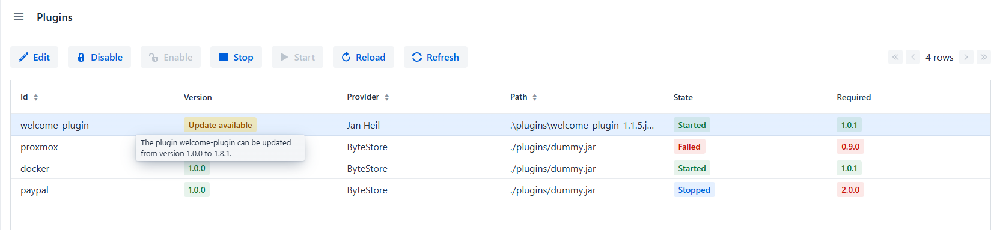
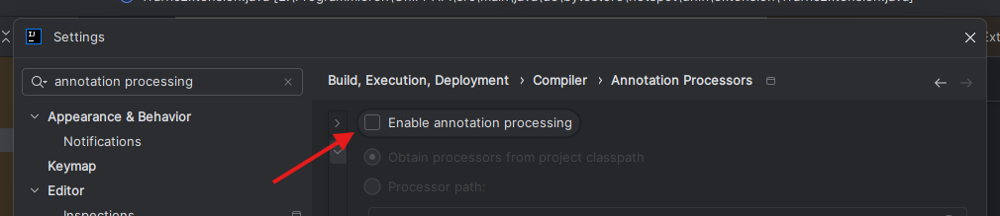
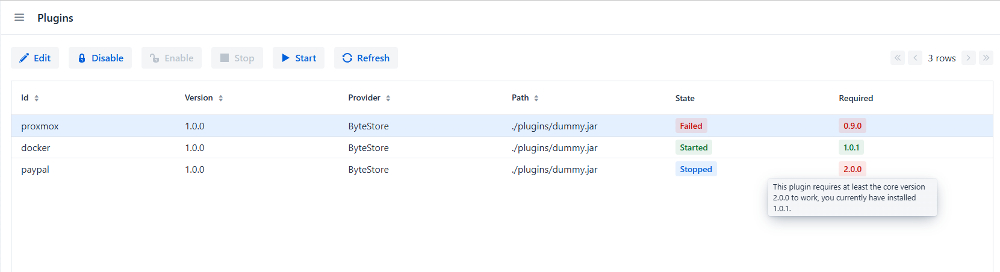
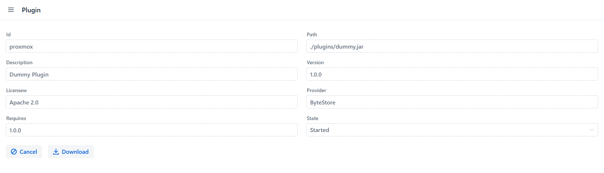

[](https://github.com/Gamer08YT/jmix-plugin-addon/actions/workflows/release.yml) [](https://github.com/Gamer08YT/jmix-plugin-addon/actions/workflows/test.yml)

# Jmix Plugin Addon

The Jmix Plugin Addon allows you to write your own plugins for [Jmix](https://jmix.io/) that are not anchored in the
source code, but are
injected via [PF4J](https://pf4j.org/).

The addon allows you to load/unload and enable/disable or update plugins via your own plugin repository.



## Manual Installation

The following table lists the add-on versions compatible with different Jmix platform versions:

| Jmix Version | Add-on Version | Dependency (Gradle Implementation) |
|--------------|----------------|------------------------------------|
| 2.4.2        | 1.3.1          | de.bytestore:plugin-starter:1.3.1  |
| 2.4.3        | 1.3.6          | de.bytestore:plugin-starter:1.3.6  |
| 2.5.0-RC1    | 1.4.0          | de.bytestore:plugin-starter:1.4.0  |
| 2.6.0-RC1    | 2.6.0          | de.bytestore:plugin-starter:2.6.0  | 
| 2.6.1        | 2.6.1          | de.bytestore:plugin-starter:2.6.1  | 

1. Add Maven Dependencies to your `build.gradle`:
    ```groovy
    implementation 'de.bytestore:plugin-starter:<addon-version>' 
    ```
2. Make sure to replace `<addon-version>` with the compatible version mentioned in the table above.

## JPA

To access JPA Objects you need to implement the Eclipse Persistence Lib otherwise you get an Error.

```groovy
compileOnly 'org.eclipse.persistence:org.eclipse.persistence.jpa'
```

## Provided Views

The Add-on comes with 4 included Views.

- PluginListView [/plugins]
- PluginDetailView [/plugins/{id}]
- RepositoryListView [/repositories]
- RepositoryDetailView [/repositories/{id}]

## Features

- Plugin Management (Disable/Enable/Start/Stop/Delete/Download/Update)
- Version Management ([Semver](https://semver.org/))
- Plugin [Development Mode](https://pf4j.org/doc/development-mode.html) (Load Modules from Sourcecode and not JAR
  Archive)
- Local Plugin Repositories
- Remote Plugin Repositories

### Create Plugin Repository

A Plugin Repository is simply a JSON Array with the Definition of the Plugin Versions, for example, `plugins.json`:

```json
[
  {
    "id": "welcome-plugin",
    "description": "Welcome plugin",
    "releases": [
      {
        "version": "1.8.1",
        "date": "2024-06-05T21:00:35",
        "url": "../../../../welcome-plugin/build/libs/welcome-plugin-1.8.1.jar"
      },
      {
        "version": "1.8.0",
        "date": "2024-06-01T20:10:21",
        "url": "../../../../welcome-plugin/build/libs/welcome-plugin-1.8.0.jar"
      }
    ]
  }
]
```

### Local Repository URI:

A local Repository could be a JSON File on your machine.

```file:/home/jaxnprivate/work/jmix-plugin-addon/resources/```

### Remote Repository URI:

A remote Repository could be a JSON File or a Route with an JSON Object on a Webserver.

```http://plugins.byte-system.de/```

### Plugin Auto-loading

To disable Plugin Auto-loading, you need to add this line to your `application.properties`.

You than can control the loading via the `PluginService`.

```properties
plugins.autoload=false
```

### Change Plugin Directory

To change Plugin Directory, you need to add this line to your `application.properties`.

```properties
plugins.home=./test/plugins
```

### Semantic Version Check

To disable globally semantic version checking, you need to add this line to your `application.properties`.

This will hide the required Field in the List UI and disables Version checking via PF4J.

```properties
plugins.version.check=false
```

### Exact Version Check

To enable exact version checks, you need to add this line to your `application.properties`.

```properties
plugins.version.exact=true
```

## Troubleshooting:

No Extensions getting found?

Please enable Annotations for your Project. see [PF4J Troubleshooting](https://pf4j.org/doc/troubleshooting.html)



If you use Gradle please add following, to your ``build.gradle``.

```groovy
annotationProcessor(group: 'org.pf4j', name: 'pf4j', version: "<pf4jVersion>")
``` 

## Screenshots






Shield: [![CC BY-NC 4.0][cc-by-nc-shield]][cc-by-nc]

This work is licensed under a
[Creative Commons Attribution-NonCommercial 4.0 International License][cc-by-nc].

[![CC BY-NC 4.0][cc-by-nc-image]][cc-by-nc]

[cc-by-nc]: https://creativecommons.org/licenses/by-nc/4.0/

[cc-by-nc-image]: https://licensebuttons.net/l/by-nc/4.0/88x31.png

[cc-by-nc-shield]: https://img.shields.io/badge/License-CC%20BY--NC%204.0-lightgrey.svg
